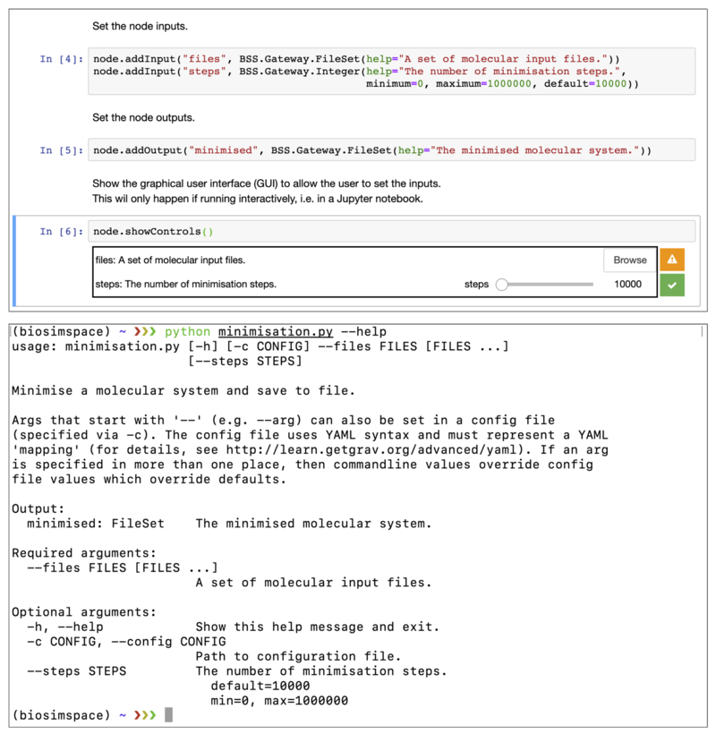
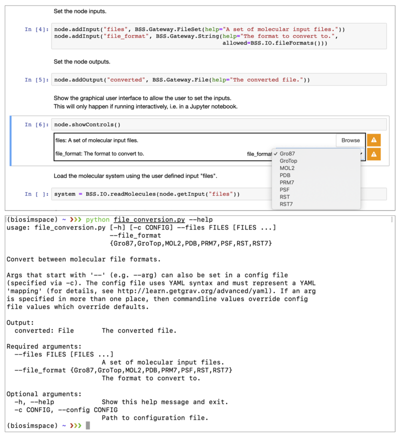

.. _ref_nodes:

=====
Nodes
=====

.. toctree::
   :maxdepth: 2

The building blocks provided with BioSimSpace can be used to write
*interoperable* workflow components, or nodes. Typically, a node will
perform a single, well-defined, unit of work with clear inputs and outputs.
The :ref:`ref-Gateway` package acts as a bridge between BioSimSpace and the
outside world, allowing a user to construct a node and define the input and
output requirements, along with restrictions on their types and values.

Writing nodes
=============

As an example, the following code snippet shows how we could write a node to
perform an energy minimisation on a molecular system loaded from file:

.. code-block:: python

    import BioSimSpace as BSS

    # Initialise the Node object.
    node = BSS.Gateway.Node("Minimise a molecular system and save to file.")

    # Set the node author and license.
    node.addAuthor(name="Lester Hedges",
                   email="lester.hedges@bristol.ac.uk",
                   affiliation="University of Bristol")
    node.setLicense("GPLv3")

    # Set the node inputs.
    node.addInput("files", BSS.Gateway.FileSet(help="A set of molecular input files."))
    node.addInput("steps", BSS.Gateway.Integer(help="The number of minimisation steps.",
                                               minimum=0, maximum=1000000, default=10000))

    # Set the node outputs.
    node.addOutput("minimised", BSS.Gateway.FileSet(help="The minimised molecular system."))

    # Show the graphical user interface (GUI) to allow the user to set the inputs.
    # This will only happen if running interactively, i.e. in a Jupyter notebook.
    node.showControls()

    # Load the molecular system using the user defined input "files".
    system = BSS.IO.readMolecules(node.getInput("files"))

    # Define the minimisation protocol using the user defined number of "steps".
    protocol = BSS.Protocol.Minimisation(steps=node.getInput("steps"))

    # Execute the process using any available molecular dynamics engine.
    process = BSS.MD.run(system, protocol)

    # Set the node output to the final configuration of the minimisation process.
    # Note that the pass block=True to the getSystem call to ensure that the
    # process finished before getting the final configuration. (It is possible
    # to query the running process in real time when running interactively.)
    # Note that the original file format of the system is preserved on write.
    node.setOutput("minimised", BSS.IO.saveMolecules("minimised",
        process.getSystem(block=True), system.fileFormat()))

    # Finally, validate the node to make sure that outputs are set correctly
    # and no errors have been raised. If running interactively, this will
    # generate a download link to a zip file containing the node outputs.
    node.validate()

Running nodes
=============

BioSimSpace nodes are flexible in the way in which they can be used, with the
same script working seamlessly from within a a `Jupyter <https://jupyter.org>`__
notebook or on the command-line. Typically, a user would a write a node as a
fully documented, interactive Jupyter notebook, then save it as a regular Python
script to run from the command-line. (In the section above we included a Python
script representation of the node, which could be re-converted to a notebook
using, e.g., `p2j <https://pypi.org/project/p2j>`__.) Any purely interactive
elements included in the node, e.g. visualisations and plots, are simply
ignored when the script is run in a non-interactive mode. To facilitate this
dual-use the node.addInput method generates a custom
`ipywidgets <https://ipywidgets.readthedocs.io/en/latest/>`__ based graphical
user interface for interative use in Jupyter, or a custom
`argparse <https://docs.python.org/3/library/argparse.html>`__ parser for
handling command-line arguments. The following figure shows the example node
above running within a Jupyter notebook (top) and from the command-line (bottom).

When working interactively, BioSimSpace also provides functionality for
interacting with processes while they are running. This allows the user to
monitor the progress of a simulation and generate near real-time plots
and visualisations.

While BioSimSpace isn't intended to be a workflow manager it does provide
a means of chaining together nodes by passing the output of one node as the
input to another. For example, given the following YAML configuration file,
``config.yaml``:

.. code-block:: yaml

    files:
    - amber/ala.crd
    - amber/ala.top

it would be possible to run a minimisation followed by an equilibration as follows:

.. code-block:: python

    python minimisation.py --config config.yaml && python equilibration.py --config output.yaml

Nodes can also be accessed from within BioSimSpace itself, allowing the user
access to existing functionality as building blocks for more complex scripts.
For example, the minimisation node can be run from within BioSimSpace as follows:

.. code-block:: python

    # Create a dictionary of inputs to the node.
    input = {"files" : ["amber/ala.crd", "amber/ala.top"], "steps" : 1000}

    # Run the node and capture the output as a dictionary.
    output = BSS.Node.run("minimisation", input)

(Note that, by default, a ``node library`` is created in a hidden ``_nodes``
directory wherever BioSimSpace is installed, e.g.
``/usr/local/lib/python3.7/site-pacakges/BioSimSpace/Nodes/_nodes``. To
set a custom directory, use the
:class:`BioSimSpace.Node.setNodeDirectory <BioSimSpace.Node.setNodeDirectory>`
function.)

Forwards compatibility
======================

To ensure that BioSimSpace nodes are forwards compatible as new features are
added all sub packages can query their own functionality and present this to
the user. For example, calling
:class:`BioSimSpace.IO.fileFormats <BioSimSpace.IO.fileFormats>`
returns a list of the currently supported molecular file formats,
:class:`BioSimSpace.Solvent.waterModels <BioSimSpace.Solvent.waterModels>`
returns a list of the supported water models, etc. These values can be passed as
the allowed keyword argument when setting an input requirement of a node, ensuring
that the node supports the latest functionality of the package version that is
installed. The following code snippet shows a node that can be used to convert
to any supported molecular file format, which will continue to work as
additional formats are added.

.. code-block:: python

    import BioSimSpace as BSS

    # Initialise the Node object.
    node = BSS.Gateway.Node("Convert between molecular file formats.")

    # Set the node author and license.
    node.addAuthor(name="Lester Hedges",
                   email="lester.hedges@bristol.ac.uk",
                   affiliation="University of Bristol")
    node.setLicense("GPLv3")

    # Set the node inputs.
    node.addInput("files", BSS.Gateway.FileSet(help="A set of molecular input files."))
    node.addInput("file_format", BSS.Gateway.String(help="The format to convert to.",
                                                    allowed=BSS.IO.fileFormats()))

    # Set the node outputs.
    node.addOutput("converted", BSS.Gateway.File(help="The converted file."))

    # Show the graphical user interface to allow the user to set the inputs.
    # This will only happen if running interactively, i.e. in a Jupyter notebook.
    node.showControls()

    # Load the molecular system using the user defined input "files".
    system = BSS.IO.readMolecules(node.getInput("files"))

    # Convert the system to the chosen format and set the output.
    node.setOutput("converted",
        BSS.IO.saveMolecules("converted", system, node.getInput("file_format")))

    # Validate the node.
    node.validate()

The following figure shows how the ``allowed=BSS.IO.fileFormats()`` argument is
translated into a dropdown menu for the Jupyter GUI (top), or using the choices
option of argparse on the command-line (bottom). This means that the script is
adaptive to the support of additional file parsers in future without need for
modification.

Examples
========

A set of example nodes are available on our :ref:`notebook server <ref_notebook>`.
