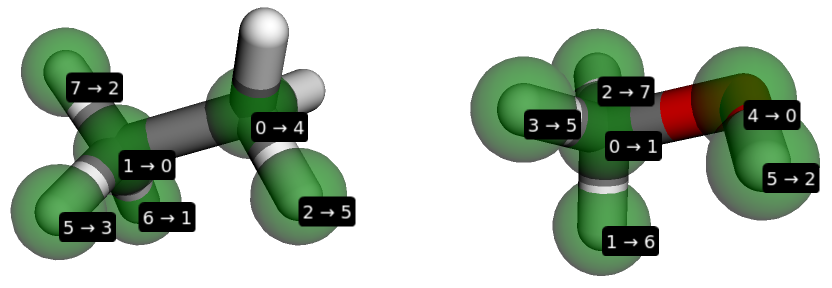

=====================
Hydration free energy
=====================

In this tutorial you'll learn how to use BioSimSpace to set up a set of *alchemical*
free energy simulations to compute the relative free energy of hydration ethane and
methanol. Alchemical free energy calculations employ unphysical ("alchemical")
intermediates to estimate the free energies of various physical processes. Here,
we will exploit a perturbation pathway between ethane and methanol which will
allow us to estimate the relative free energy difference in solution,
:math:`{\Delta G_{\mathrm{sol}}}`, and vacuum, :math:`{\Delta G_{\mathrm{vac}}}`.
The free energy of hydration, :math:`{\Delta\Delta G_{\mathrm{hyd}}}` can then be
computed from the difference between the free energy of the solvation and vacuum
simulation legs, i.e.

:math:`{\Delta\Delta G_{\mathrm{hyd}} = \Delta G_{\mathrm{sol}} - \Delta G_{\mathrm{vac}}}`

To get started, let's import BioSimSpace and create ethane and methanol
molecules parameterised with the Generalised AMBER Force-Field (GAFF).

>>> import BioSimSpace as BSS
>>> ethane = BSS.Parameters.gaff("CC").getMolecule()
>>> methanol = BSS.Parameters.gaff("CO").getMolecule()

In order to create a perturbation between the two molecules we need to define
a mapping. This mapping defines the maximum common substructure (MCS) between
the molecules, mapping indices from one to the matching indices in the other.
The :data:`BioSimSpace.Align` package provides tools for calculating the
mappings between molecules and for aligning and merging molecules based on a
mapping. The user can request a multiple mappings, which can be scored and
aligned in various ways. Here we'll simply use the default options and compute
the highest scoring mapping between the molecules:

>>> mapping = BSS.Align.matchAtoms(ethane, methanol)

The mapping is just a dictionary mapping atoms in the ethane molecule to those
in the methanol. To see what atoms have been mapped we can print the
corresponding atoms from each molecule:

>>> for idx0, idx1 in mapping.items():
...     print(ethane.getAtoms()[idx0], "<-->", methanol.getAtoms()[idx1])
...
<BioSimSpace.Atom: name='H', molecule=2 index=5> <--> <BioSimSpace.Atom: name='H3', molecule=3 index=3>
<BioSimSpace.Atom: name='C', molecule=2 index=1> <--> <BioSimSpace.Atom: name='C', molecule=3 index=0>
<BioSimSpace.Atom: name='H', molecule=2 index=6> <--> <BioSimSpace.Atom: name='H1', molecule=3 index=1>
<BioSimSpace.Atom: name='H', molecule=2 index=7> <--> <BioSimSpace.Atom: name='H2', molecule=3 index=2>
<BioSimSpace.Atom: name='C', molecule=2 index=0> <--> <BioSimSpace.Atom: name='OH', molecule=3 index=4>
<BioSimSpace.Atom: name='H', molecule=2 index=2> <--> <BioSimSpace.Atom: name='HO', molecule=3 index=5>

When working running interactively, e.g. within an `IPython <https://ipython.readthedocs.io/en/stable>`__,
console or `Jupyter <https://jupyter.org>`__ notebook, it's
possible to visualise the mapping:

>>> BSS.Align.viewMapping(ethane, methanol, mapping)

The two molecules are displayed side-by-side with numbers used to indicate
which atoms map to each other. For eample, the carbon indexed 0 in the ethane
molecule maps to a hydrogen indexed 4 in the methanol.

Next we need to align the ethane molecule to the methane based on the mapping.
The :data:`BioSimSpace.Align.rmsdAlign` function will align them based on a root
mean square displacement (RMSD) scoring function, whereas
:data:`BioSimSpace.Align.flexAlign` will flexibly align ethane to methanol using the
`fkcombu <https://pdbj.org/kcombu/doc/README_fkcombu.html>`__ program,
which can be useful if you want both molecules to be aligned to a specific pose.
For simplicity we'll use the RMSD alignment:

>>> ethane = BSS.Align.rmsdAlign(ethane, methanol, mapping)

.. note ::

   If we were to omit the mapping argument above, then the :data:`rmsdAlign`
   function would compute the best mapping for us automatically. This means
   that we can choose to compute the mapping then align separately, or do
   the whole thing in one step.

Having successfully aligned the ethane molecule, we now need to merge the two
molecules together to create a merged (or perturbable molecule). This contains
all of the properties, e.g. bonds, angles, dihedrals, needed to define the two
molecules at either end state of the perturbation,
:math:`{\lambda=0}` and :math:`{\lambda=1}`. The end states represent the two
molecules (ethane in one state, methanol in the other) plus dummy (or virtual)
atoms for any atoms from the other molecule that aren't part of the MCS.

>>> merged = BSS.Align.merge(ethane, methanol, mapping)

Next we need to solvate our merged molecule in a box of water. Here we'll use
the TIP3P water model and a cubic box with a base length of 5 nanometers:

>>> solvated = BSS.Solvent.tip3p(molecule=merged, box=3 * [5 * BSS.Units.Length.nanometer])

Finally we can create objects to perform the perturbations for each leg of
the calculation, which will automatically configure everything that is needed
to run the simulations. First we will use our built in, GPU optimised, molecular
dynamics engine called SOMD. (This is a wrapper around the excellent
`OpenMM <https://openmm.org>`__ package and is the default engine if no other
packages are present.)

.. note ::

   It's possible to use a different protocol or molecular dynamics engine for each leg.

>>> free_somd = BSS.FreeEnergy.Relative(solvated, protocol, engine="somd", work_dir="freenrg_somd/free")
>>> vac_somd = BSS.FreeEnergy.Relative(merged.toSystem(), protocol, engine="somd", work_dir="freenrg_somd/vacuum")

When complete, BioSimSpace will have set up a folder hierarchy containing
everything that is needed to run the hydration free energy calculation
using SOMD. Let's examine the `work_dir` for the free (solvated) leg
specified above:

.. code-block:: bash

   $ ls freenrg_somd
   free  vacuum

Inside the top-level directory are two sub-directories called `free` and `vacuum`.
These correspond the the solvated and vacuum legs of the simulation. Let's further
examine the free directory to see what's inside:

.. code-block:: bash

   $ ls freenrg_somd/free
   lambda_0.0000  lambda_0.3000  lambda_0.6000  lambda_0.9000
   lambda_0.1000  lambda_0.4000  lambda_0.7000  lambda_1.0000
   lambda_0.2000  lambda_0.5000  lambda_0.800

Inside this are 11 further sub-directories, one for each of the :math:`{\lambda}`
windows of the leg. Within each of these directories are all of the files needed
to run an individual simulation, e.g.:

.. code-block:: bash

   $ ls freenrg_somd/free/lambda_0.0000
   somd.cfg  somd.err  somd.out  somd.pert  somd.prm7  somd.rst7

The :data:`BioSimSpace.FreeEnergy.Relative` object can also automatically run
all of the simulations for you and analyse the output that is generated. However,
since these simulations will take a long time we won't run them here.

By specifying a different molecular dynamics engine, we can use the
exact same code to set up an identical set of simulations with GROMACS:

>>> free_gmx = BSS.FreeEnergy.Relative(solvated, protocol, engine="gromacs", work_dir="freenrg_gmx/free")
>>> vac_gmx = BSS.FreeEnergy.Relative(merged.toSystem(), protocol, engine="gromacs", work_dir="freenrg_gmx/vacuum")

Let's examine the directory for the :math:`{\lambda=0}` window of the free leg:

.. code-block:: bash

   $ ls freenrg_gmx/free/lambda_0.0000
   gromacs.err  gromacs.mdp  gromacs.out.mdp  gromacs.tpr
   gromacs.gro  gromacs.out  gromacs.top

There you go! This tutorial has shown you how BioSimSpace can be used to easily set
up everything that is needed for complex alchemical free energy simulations. Please
visit the :data:`API documentation <BioSimSpace.FreeEnergy>` for further information.
