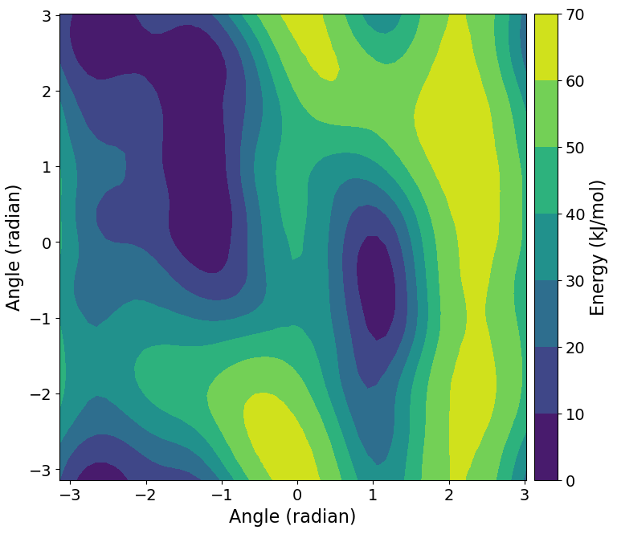

============
Metadynamics
============

.. note ::

   You will need to install a version of `GROMACS <https://www.gromacs.org>`__
   patched with `PLUMED <https://www.plumed.org>`__ into your environment in
   order to be able to run this tutorial.

In this tutorial you'll use BioSimSpace to set up and run a simple
`metadyamics <https://en.wikipedia.org/wiki/Metadynamics>`__ simulation to
calculate the free energy as a function of the :math:`{\phi}` and :math:`{\psi}`
dihedral angles for an alanine dipeptide molecule in vacuum.

.. image:: https://raw.githubusercontent.com/CCPBioSim/biosimspace-advanced-simulation/de3f65372b49879b788f46618e0bfef78b2559b9/metadynamics/assets/alanine_dipeptide.png
   :alt: An alanine dipeptide molecule with dihedral angles shown.

Import :mod:`BioiSmSpace` using

>>> import BioSimSpace as BSS

Load a molecular system from a URL, via :func:`BioSimSpace.IO.readMolecules`:

>>> url = BSS.tutorialUrl()
>>> system = BSS.IO.readMolecules([f"{url}/ala.top", f"{url}/ala.crd"])

Note that this is a solvated system, which contains the alanine dipeptide and a bunch of water molecules.
Since we want to study the molecule in vacuum, we will extract the alanine dipeptide using a search:

>>> search = system.search("resname ALA").molecules()
>>> print(search)
<BioSimSpace.SearchResult: nResults=1>

.. note ::

   Searches typically return the smallest unit, i.e. an atom, so we call
   :data:`.molecules()` to convert the result to a set of molecules that contain
   the search. BioSimSpace uses sire's powerful
   `search functionality <https://sire.openbiosim.org/cheatsheet/search.html>`__.

We found a single matching result. Lets extract the result from the search object:

>>> molecule = search[0]

Let's now examine each of the atoms in the molecule to make sure that it looks like we'd expect:

>>> for atom in molecule.getAtoms():
...     print(atom)
...
<BioSimSpace.Atom: name='HH31', molecule=2 index=0>
<BioSimSpace.Atom: name='CH3', molecule=2 index=1>
<BioSimSpace.Atom: name='HH32', molecule=2 index=2>
<BioSimSpace.Atom: name='HH33', molecule=2 index=3>
<BioSimSpace.Atom: name='C', molecule=2 index=4>
<BioSimSpace.Atom: name='O', molecule=2 index=5>
<BioSimSpace.Atom: name='N', molecule=2 index=6>
<BioSimSpace.Atom: name='H', molecule=2 index=7>
<BioSimSpace.Atom: name='CA', molecule=2 index=8>
<BioSimSpace.Atom: name='HA', molecule=2 index=9>
<BioSimSpace.Atom: name='CB', molecule=2 index=10>
<BioSimSpace.Atom: name='HB1', molecule=2 index=11>
<BioSimSpace.Atom: name='HB2', molecule=2 index=12>
<BioSimSpace.Atom: name='HB3', molecule=2 index=13>
<BioSimSpace.Atom: name='C', molecule=2 index=14>
<BioSimSpace.Atom: name='O', molecule=2 index=15>
<BioSimSpace.Atom: name='N', molecule=2 index=16>
<BioSimSpace.Atom: name='H', molecule=2 index=17>
<BioSimSpace.Atom: name='CH3', molecule=2 index=18>
<BioSimSpace.Atom: name='HH31', molecule=2 index=19>
<BioSimSpace.Atom: name='HH32', molecule=2 index=20>
<BioSimSpace.Atom: name='HH33', molecule=2 index=21>

The atoms that define the two dihedrals are:

:math:`{\phi}`: C index=4, N index=6, CA index=8, C index=14

:math:`{\psi}`: N index=6, CA index=8, C index=14, N index=16

Let's store the indices:

>>> phi_idx = [4, 6, 8, 14]
>>> psi_idx = [6, 8, 14, 16]

Now we need to construct to *collective variables* that represent the dihedrals (torsions)
above. These are the variables that will be sampled during our metadynamics simulation,
allowing us to estimate the free energy of the system as a function of the dihedral angles.

>>> phi = BSS.Metadynamics.CollectiveVariable.Torsion(atoms=phi_idx)
>>> psi = BSS.Metadynamics.CollectiveVariable.Torsion(atoms=psi_idx)

Note how we passed the indices of the atoms involved in the torsion to the constructor.
Since atoms are indexed relative to the molecule that they belong it is important that
we get the absolute atom index within the system. In this case we have a single molecule,
so all is okay, but in general you should be careful. For example, atom index 2 in
molecule 2 won't be atom index 2 in the system, i.e. you would have to shift the index
by the number of atoms in molecule 1.

Thankfully we provide simple tools to compute this index for you. For example,
for atom CA in the molecule:

>>> atom = molecule.search("atomname CA")[0]
>>> print(system.getIndex(atom))
8

(In this case we get the same index as the molecule since the alanine dipeptide
is the first molecule in the system.)

There are many other options that can be set for collective variables, such as
setting the width of the Gaussian hill that is used to bias a variable, specifying
lower and upper bounds for the value of the variable, and sampling on a pre-defined
grid to help speed up simulations. See :data:`BioSimSpace.Metadynamics.CollectiveVariable.Torsion`
for more information.

We now need a protocol to describe our metadynamics simulation. Let's go with the defaults,
other than increasing the run time to 3 nanoseconds.

>>> protocol = BSS.Protocol.Metadynamics(collective_variable=[phi, psi], runtime=3 * BSS.Units.Time.nanosecond)

Finally, we need a process to actually run our metadynamics simulation. BioSimSpace will
automatically configure this for you with the
:data:`BioSimSpace.Metadynamics.run` function. Note that the function expects a
:data:`System <BioSimSpace._SireWrappers.System>` and a
:data:`Protocol <BioSimSpace.Protocol>` as arguments, so we convert
our alanine dipeptide molecule to a single-molecule system.

>>> process = BSS.Metadynamics.run(molecule.toSystem(), protocol, gpu_support=True)

All being well, we should now have a simulation process running in the background.
Let's check that it's running:

>>> process.isRunning()
True

To see the PLUMED configuration file that was generated:

>>> process.getPlumedConfig()
['RESTART NO',
 '\n# Define the molecular entities.',
 'WHOLEMOLECULES ENTITY0=1-22',
 '\n# Define the collective variable.',
 't1: TORSION ATOMS=5,7,9,15',
 '\n# Define the collective variable.',
 't2: TORSION ATOMS=7,9,15,17',
 '\n# Define the metadynamics simulation.',
 'metad: METAD ARG=t1,t2 SIGMA=0.35,0.35 HEIGHT=1.0 PACE=1000 TEMP=300.0',
 'PRINT STRIDE=1000 ARG=* FILE=COLVAR']

If running interactively, e.g. within an `IPython <https://ipython.readthedocs.io/en/stable>`__,
console or `Jupyter <https://jupyter.org>`__ notebook, it's
possible to interact with the process directly. In this case, we will wait
for the process to end, then analyse the results.

To wait for the process to finish, simply run:

>>> process.wait()

Assuming you are working interactively, we can then plot the time evolution of the two
collective variables as follows:

>>> BSS.Notebook.plot(x=process.getTime(time_series=True), y=process.getCollectiveVariable(0, time_series=True))
>>> BSS.Notebook.plot(x=process.getTime(time_series=True), y=process.getCollectiveVariable(1, time_series=True))

.. note ::

   The :data:`getCollectiveVariable` function takes the indices of the collective
   variables that we passed to the :data:`Protocol` construtor, i.e.
   0 = :math:`{\phi}` and 1 = :math:`{\psi}`.

.. note ::

   BioSimSpace automatically writes labels for the axis of any plot based on the
   type of the input data.

It is also possible to compute the free energy estimate as a function of
:math:`{\phi}` and :math:`{\psi}` and create a contour plot:

>>> free_nrg = process.getFreeEnergy(kt=BSS.Units.Energy.kt)
>>> BSS.Notebook.plotContour(free_nrg[0], free_nrg[1], free_nrg[2])

.. note ::

   The returned :data:`free_nrg` object is a tuple, containing lists for the values of
   :math:`{\phi}` and :math:`{\psi}`, and the corresponding free energy estimate.

If we are only interested in the free energy as a function of a single collective
variable, then it's possible to perform a projection by integrating out the other
variables. We can do this by passing the index of the collective variable of
interest to the :data:`getFreeEnergy` function, along with an appropriate
temperature factor (in energy units) for integrating out the other variables.
For example, to get the free energy as a function of :math:`{\phi}` only,
then visualise as a simple :math:`{x-y}` plot:

>>> free_nrg_phi = process.getFreeEnergy(index=0, kt=BSS.Units.Energy.kt)
>>> BSS.Notebook.plot(x=free_nrg_phi[0], y=free_nrg_phi[1])

Having successfully sampled the free energy landscape as a function of the
:math:`{\phi}` and :math:`{\psi}` dihedral angles, we might next want to examine
representative snapshots from the basins. To do this we can use the
:data:`sampleConfigurations` method of the process object. This takes a list of
bounds for the values of the collective variables as an argument, along with the
maximum number of snaphots that we would like. The method returns a list of randomly
sampled molecular configurations that lie within the bounds, along with a list
containing the corresponding collective variable values.

Let's consider the basin just to the right in the middle of the free-energy
contour plot above. This lies roughly at :math:`{0.5\geq\phi\leq1.5}` and
:math:`{−1.5\geq\psi\leq0.5}`.

>>> bounds = [(0.5 * BSS.Units.Angle.radian, 1.5 * BSS.Units.Angle.radian), (-1.5 * BSS.Units.Angle.radian, 0.5 * BSS.Units.Angle.radian)]
>>> configs, colvars = process.sampleConfigurations(bounds, 20)

Let's examine the value of the collective variables for each sample to make sure they are in range:

>>> print(colvars)
[(0.8042 radians, 0.2273 radians),
 (0.8847 radians, -1.4034 radians),
 (0.8235 radians, -0.1592 radians),
 (0.7356 radians, 0.2072 radians),
 (1.3030 radians, -1.4957 radians),
 (0.6453 radians, -0.5592 radians),
 (1.1190 radians, -0.8228 radians),
 (0.8684 radians, -0.9700 radians),
 (0.9376 radians, -0.8589 radians),
 (0.8618 radians, -0.2619 radians),
 (1.1161 radians, -0.0558 radians),
 (1.2556 radians, 0.3660 radians),
 (1.4522 radians, 0.4241 radians),
 (0.6214 radians, -1.4681 radians),
 (1.2177 radians, -0.0263 radians),
 (1.3990 radians, -1.2203 radians),
 (0.9836 radians, -0.0206 radians),
 (1.0810 radians, -0.0643 radians),
 (1.2382 radians, 0.3638 radians),
 (1.2085 radians, -0.4942 radians)]

We hope that you have enjoyed this tutorial. Please explore the metadynamics
:data:`API documentation <BioSimSpace.Metadynamics>` for further information.
