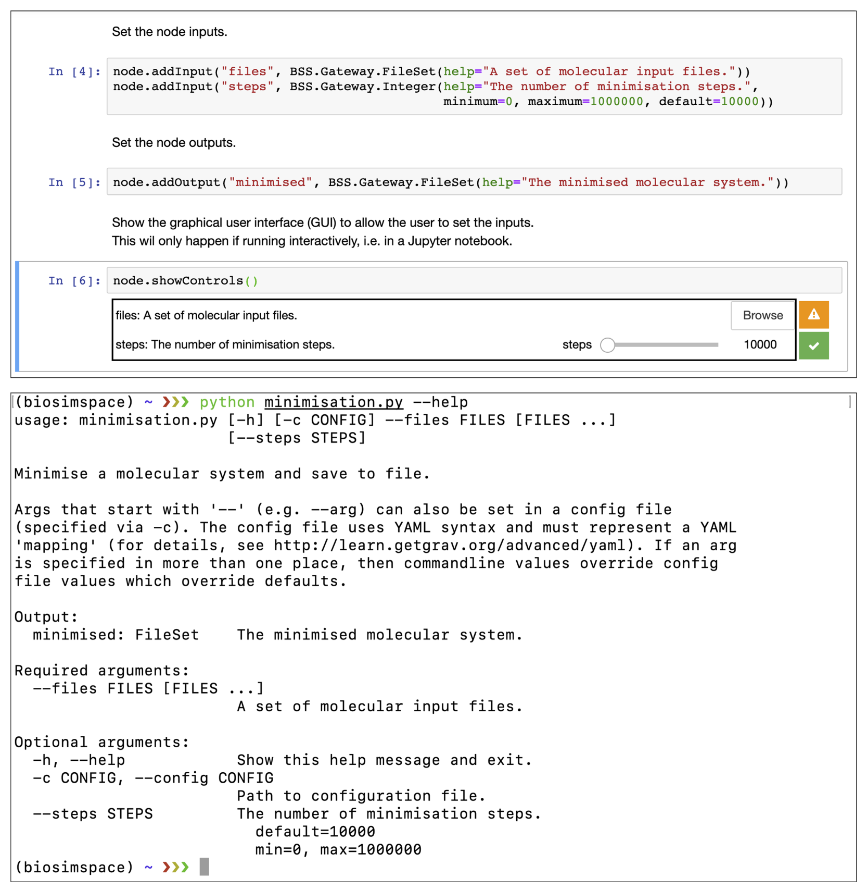
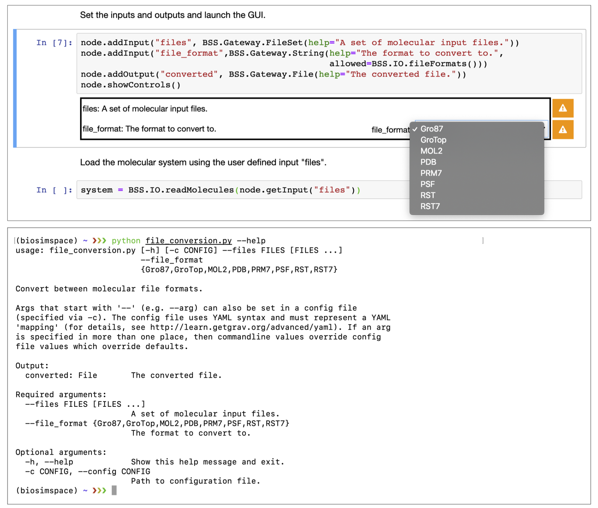

# Summary

Biomolecular simulation is a diverse and growing area of research, making important contributions to structural biology and pharmaceutical research [@ref-CCPBioSimWIRES]. Within the community there are a several significant and widely used software packages that have evolved from within various research groups over the past 20 or more years. For example, the molecular dynamics packages [AMBER](http://ambermd.org) [@ref-AMBER], [GROMACS](http://www.gromacs.org) [@ref-GROMACS], and [NAMD](https://www.ks.uiuc.edu/Research/namd) [@ref-NAMD], which are all capable of running biomolecular simulations for systems consisting of hundreds of thousands of atoms and can be run on hardware ranging from laptops, to graphics processing units (GPUs), to the latest high-performance computing clusters. Since different software packages were developed independently, interoperability between them is poor. In large part this is the result of major differences in the supported file formats, which makes it difficult to translate the inputs and outputs of one program to another. As a consequence, expertise in one package doesn't immediately apply to another, making it hard to share methodology and knowledge between different research communities, as evidenced, for instance, by a recent study on reproducibility of relative hydration free energies across simulation packages [@ref-reprodDDG]. The issue is compounded by the increasing use of biomolecular simulations as components of larger scientific workflows for bioengineering or computer-aided drug design purposes. A lack of interoperability leads to brittle workflows, poor reproducibility, and lock in to specific software that hinders dissemination of biomolecular simulation methodologies to other communities.

Several existing software packages attempt to address this problem: [InterMol](https://github.com/shirtsgroup/InterMol) [@ref-INTERMOL] and [ParmEd](https://github.com/ParmEd/ParmEd) [@ref-PARMED] can be used to read and write a wide variety of common molecular file formats; [ACPYPE](https://www.ccpn.ac.uk/v2-software/software/ACPYPE-folder) [@ref-ACPYPE] can generate small molecule topologies and parameters for a variety of molecular dynamics engines; [MDTraj](http://mdtraj.org) [@ref-MDTRAJ] and [MDAnalysis](https://www.mdanalysis.org) [@ref-MDANALYSIS] support reading, writing, and analysis of different molecular trajectory formats; the [Atomic Simulation Engine](https://wiki.fysik.dtu.dk/ase) (ASE) handles a wide variety of atomistic simulation tasks and provides interfaces to a range of external packages; and the [Cuby](http://cuby4.molecular.cz) [@ref-CUBY] framework allows access to a range of computational chemistry functionality from external packages, which can be combined into complex workflows through structured input files. Despite their utility, the above packages either have a restricted domain of application, e.g. trajectory files, or require different configuration options or scripts to interface with different external packages. It is not possible to write a _single_ script that is _independent_ of the underlying software packages installed on the host system.

Within the Collaborative Computational Project for Biomolecular Simulation ([CCPBioSim](http://www.ccpbiosim.ac.uk)), we have attempted to solve this problem via the introduction of an interoperable framework, [BioSimSpace](https://biosimspace.org), that collects together the core functionality of many packages and exposes it through a simple Python API. By not choosing to reinvent the wheel, we can take advantage of all the exsting software within the community, and can easily plug into new software packages as they appear. Our software can convert between many common molecular file formats and automatically find packages available within the environment on which it is run. This allows the user to write portable workflow components that can be run with different input, on different environments, and in completely different ways, e.g. from the command-line, or within a [Jupyter](https://jupyter.org) notebook running on a cloud server. BioSimSpace builds on ideas explored previously by CCPBioSim during the development of the alchemical free energy calculations software [FESetup](https://github.com/CCPBioSim/fesetup) [@ref-FESetup] that provides consistent setup of input files for several simulation engines.

# Molecular dynamics

One of the core features of BioSimSpace is the ability to set up and run molecular dynamics (MD) simulations. There are a large number of packages that can run MD for biomolecules and BioSimSpace supports several of these: AMBER, GROMACS, and NAMD. BioSimSpace also comes with a bundled MD engine, [SOMD](https://siremol.org/tutorials/somd), which interfaces with the [OpenMM](http://openmm.org) [@ref-OPENMM] toolkit to provide GPU acceleration. This means that there is always a fall back in case no other MD engines are installed.

While, broadly speaking, the different MD engines offer a similar range of features, their interfaces are quite different. At the heart of this problem is the incompatibility between the molecular file formats used by the different packages. While they all contain the same information, i.e. how atoms are laid out in space and how they interact with each other, the structure of the files is very different. In order to provide interoperability betwen packages we need to be able to read and write many different file formats, and be able to interconvert between them too.

# Features

## Parsers

At its core, BioSimSpace is built around a powerful set of file parsers which allow reading and writing of a wide range of molecular file formats. File input/output is provided via the `BioSimSpace.IO` package using parsers from the [Sire](http://siremol.org) [@ref-SIRE] molecular simulation framework, on top of which BioSimSpace is built. Unlike many other programs, we take the approach that it is the _contents_ of the file that defines it format, not the _extension_. As such, we attempt to parse a file with all of our parsers in parallel. Any parser for which the contents of the file is incompatible will be rejected early, with the eventual format of the file determined by the parser that completed without error.

Typically, the information needed to construct a molecular system is split across multiple files, e.g. a _coordinate_ file containing the atomic coordinates, and a _topology_ file that describes how the atoms within each molecule are bonded together, along with parameters for the potential of the molecular model. To handle this, each of our parsers are assigned as being able to _lead_, or _follow_, or both. Lead parsers are able to initialise a molecular system (typically by constructing the topology), whereas those that follow can add additional information to an existing molecular system. Lead parsers may also be able to follow, such that when multiple lead parsers are associated with a set of files then the one that ultimately leads will be determined by which lead parser is unable to follow. This approach allows us to easily parse molecular information from multiple files, even if those formats aren't typically associated with each other. As long as the molecular topology corresponding to the information in the files is consistent, then they can be read. For instance, one can initialise a system by reading an AMBER format topology, and obtain the coordinates of the system from a [Protein Data Bank](https://www.rcsb.org) (PDB) file.

As files are parsed, records in those files are assigned to a set of _properties_ that are associated with molecules in the system, e.g. `charge`, `coordinates`, `element`, etc. While some of these properties are unique to particular parsers, others are shared across formats and are converted to a consistent set of internal units on read. Those properties which represent mathematical expressions are stored using Sire's built in computer algebra system. On write, each parser expects molecules in the system to contain a specific set of properties, which are then extracted and converted in order to generate the appropriate records for the format in question. In this way, a bond record from an AMBER format file can be read into an internal bond expression, which could then be converted to the appropriate GROMACS bond record on write. Figure 1 shows a schematic of the file parsing process.

![Files are parsed in parallel with the parser that successfully reads the file determining the file format. Once all files are parsed, a lead parser (solid red arrows) constructs the topology of the molecular system. Records within the file, e.g. representing terms in the molecular potential such as bonds, angles, etc., are converted into file format specific representations, then stored internally as properties of the molecule as general algebraic expressions. Parsers that follow add additional information to an existing system. Here the `AmberRst7` parser adds coordinate and simulation box data to the system (dashed blue arrows). The file format associated with the files is also stored as a property of the system so that it is always possible to convert back to the original format on write.](figures/fig1.png)

Another feature of our parsers is guaranteed read/write self-consistency. Any file that can be read can also be written, and vice-versa. In addition, when expected molecular information is missing from a file we don't attempt to guess what it may have been. In this sense our parsers don't attempt to be _too_ clever, which can lead to unexpected behaviour, particularly when information is modified or supplemented behind the user's back.

The code below shows how to load a set of AMBER format files from a directory:

```python
import BioSimSpace as BSS

system = BSS.IO.readMolecules(BSS.IO.glob("amber/ala/*"))
```

## Protocols and Processes

BioSimSpace simplifies the set-up and running of molecular simulations through an abstraction of simulation _protocols_ and _processes_. Protocols define what a user wants to do to a molecular system, e.g. performing a _minimisation_ to find the local potential energy minimum. Processes are used to apply a protocol to a system using a specific molecular simulation engine.

The `BioSimSpace.Protocol` package provides a set of high-level objects for several common molecular simulation protocols. Each protocol offers as set of configurable options that are handled by all of the molecular simulation engines that we support. `BioSimSpace.Process` provides objects for configuring, running, and interacting with simulation processes for each of the supported engines. When a process is created by passing in a system and protocol, BioSimSpace automatically writes all of the input files required by the specific simulation engine and configures any command-line options required by its executable. Expert users of a particular engine are free to fully override any of the configuration options if desired.

The example below shows how to configure and run a default energy minimisation protocol for the molecular system that was loaded earlier. Here we use AMBER as the MD engine:

```python
protocol = BSS.Protocol.Minimisation()
process = BSS.Process.Amber(system, protocol)
process.start()
```

## Interoperability

While it is useful to be able to configure and run simulation processes using specific engines, any script written in this way would not be portable since we can't guarantee what software will be available on a different computer. To this end, the `BioSimSpace.MD` package provides functionality for automatically configuring a simulation process using _any_ suitable MD engine that is installed on the host system. As long as the user has installed an external package using the default installation procedure for that package, or has made sure that the executable is in their shell's path, BioSimSpace will find it. In the case of finding multiple MD engines, BioSimSpace will make a choice based on the file format of the system (to minimise conversions) and whether the user requests GPU support. As an example, the AMBER specific example in the previous section can be translated to an interoperable alternative as follows:

```python
protocol = BSS.Protocol.Minimisation()
process = BSS.MD.run(system, protocol)
# By default MD.run starts the process automatically.
```

The `BSS.MD.run` function searches the system for suitable packages that support the chosen protocol, then chooses the most appropriate one to run the simulation. For example, if AMBER was installed then the process returned by `BSS.MD.run` would be of type `BSS.Process.Amber`, if not then the input files could be converted to a different format allowing the use of a different process such as `BSS.Process.Gromacs`.

## Robust and flexible workflow components

The building blocks described above can be used to write interoperable workflow components, or _nodes_. Typically, a node will perform a single, well-defined, unit of work with clear inputs and outputs. The `BioSimSpace.Gateway` package acts as a bridge between BioSimSpace and the outside world, allowing a user to construct a node and define the input and output requirements, along with restrictions on their types and values. As an example, the following code snippet shows how the minimisation example described above can be translated into a node.

```python
import BioSimSpace as BSS

# Initialise the Node object and set metadata.
node = BSS.Gateway.Node("Minimise a molecular system and save to file.")
node.addAuthor(name="Lester Hedges",
               email="lester.hedges@bristol.ac.uk",
               affiliation="University of Bristol")
node.setLicense("GPLv3")

# Set the inputs and outputs.
node.addInput("files",
    BSS.Gateway.FileSet(help="A set of molecular input files."))
node.addInput("steps",
    BSS.Gateway.Integer(help="The number of minimisation steps.",
                        minimum=0, maximum=1000000, default=10000))
node.addOutput("minimised",
    BSS.Gateway.FileSet(help="The minimised molecular system."))

# Show the graphical user interface (GUI) to allow the user to set the inputs.
# This will only happen if running from within a Jupyter notebook.
node.showControls()

# Load the molecular system and define the a minimisation protocol using the
# user-define input.
system = BSS.IO.readMolecules(node.getInput("files"))
protocol = BSS.Protocol.Minimisation(steps=node.getInput("steps"))

# Execute a simulation process using any available molecular dynamics engine.
process = BSS.MD.run(system, protocol)

# Set the node output to the final configuration of the minimisation process.
# Note that the block=True to the getSystem call to ensure that the
# process finishes before getting the final configuration. (It is possible
# to query the running process in real time when running interactively.)
# Note also that the original file format of the system is preserved on write.
node.setOutput("minimised", BSS.IO.saveMolecules("minimised",
    process.getSystem(block=True), system.fileFormat()))

# Finally, validate the node to make sure that outputs are set correctly
# and no errors have been raised. If running interactively, this will
# generate a download link to a zip file containing the node outputs.
node.validate()
```

\pagebreak

BioSimSpace nodes are flexible in the way in which they can be used, with the same script working seamlessly from within a Jupyter notebook or on the command-line. Typically, a user would a write a node as a fully documented, interactive Jupyter notebook, then save it as a regular Python script to run from the command-line. (For inclusion here we simply include the Python script representation of the node, which could be re-converted to a notebook using, e.g., [p2j](https://github.com/remykarem/python2jupyter).) Any purely interactive elements included in the node, e.g.  visualisations and plots, are simply ignored when the script is run in a non-interactive mode. To facilitate this dual-use the `node.addInput` method generates a custom [ipywidgets](https://ipywidgets.readthedocs.io/en/latest) based graphical user interface for interative use in Jupyter, or a custom [argparse](https://docs.python.org/3/library/argparse.html) parser for handling command-line arguments. Figure 2 shows the example node above running within a Jupyter notebook (top) and from the command-line (bottom).



When working interactively, BioSimSpace also provides functionality for interacting with processes while they are running. This allows the user to monitor the progress of a simulation and generate near real-time plots and visualisations.

While BioSimSpace isn't intended to be a workflow manager it does provide a means of chaining together nodes by passing the output of one node as the input to another. For example, given the following [YAML](https://yaml.org) configuration file, `config.yaml`:

```yaml
files:
- amber/ala.crd
- amber/ala.top
```

\pagebreak

it would be possible to run a minimisation followed by an equilibration as follows:

```sh
python minimisation.py --config config.yaml && \
python equilibration.py --config output.yaml
```

Nodes can also be run from within BioSimSpace itself, allowing the user access to existing functionality as building blocks for more complex scripts. For example, the minimisation node can be run from within BioSimSpace as follows:

```python
# Create a dictionary of inputs to the node.
input = {"files" : ["amber/ala.crd", "amber/ala.top"], "steps" : 1000}

# Run the node and capture the output as a dictionary.
output = BSS.Node.run("minimisation", input)
```

## Forwards compatibility

To ensure that BioSimSpace nodes are forwards compatible as new features are added all sub packages can query their own functionality and present this to the user. For example, calling `BioSimSpace.IO.fileFormats()` returns a list of the currently supported molecular file formats, `BioSimSpace.Solvent.waterModels()` returns a list of the supported water models, etc. These values can be passed as the `allowed` keyword argument when setting an input requirement of a node, ensuring that the node supports the latest functionality of the package version that is installed. The following code snippet shows a node that can be used to convert to any supported molecular file format, which will continue to work as additional formats are added.

```python
import BioSimSpace as BSS

# Initialise the Node object and set metadata.
node = BSS.Gateway.Node("Convert between molecular file formats.")
node.addAuthor(name="Lester Hedges",
               email="lester.hedges@bristol.ac.uk",
               affiliation="University of Bristol")
node.setLicense("GPLv3")

# Set the inputs and outputs and launch the GUI.
node.addInput("files",
    BSS.Gateway.FileSet(help="A set of molecular input files."))
node.addInput("file_format",
    BSS.Gateway.String(help="The format to convert to.",
                       allowed=BSS.IO.fileFormats()))
node.addOutput("converted", BSS.Gateway.File(help="The converted file."))
node.showControls()

# Load the molecular system using the user defined input "files".
system = BSS.IO.readMolecules(node.getInput("files"))

# Convert the system to the chosen format and set the output.
node.setOutput("converted",
    BSS.IO.saveMolecules("converted", system, node.getInput("file_format")))

node.validate()
```

Figure 3 shows how the `allowed=BSS.IO.fileFormats()` argument is translated into a dropdown menu for the Jupyter GUI (top), or using the _choices_ option of argparse to display the available options on the command-line (bottom). This means that the script is adaptive to the support of additional file parsers in future without need for modification.



## Extensibility

BioSimSpace has been developed with the intention of being easily extensible. Adding support for a new MD engine just requires the creation of a new `BioSimSpace.Process` class and accompanying functionality to translate the high level `BioSimSpace.Protocol` objects into package specific configuration files. Similarly, it is easy to add support for new tools and utilities as long as they read and write to one of the many molecular file formats that we support. For example, as an alternative to our built in molecular alignment code, it was trivial to wrap the [FKCOMBU](http://strcomp.protein.osaka-u.ac.jp/kcombu/doc/README_fkcombu.html) program from the [KCOMBU](http://strcomp.protein.osaka-u.ac.jp/kcombu) [@ref-KCOMBU] package to enable flexible alignment of molecules. Importantly, support for new packages doesn't change our core API so that new functionality is exposed to users without breaking existing scripts.

## Advanced simulation methods

As well as the basic molecular dynamics protocols described so far, BioSimSpace also supports several advanced biomolecular simulation techniques that can be deployed with modular pipelines of setup, run, and analysis nodes executed with best-practices protocols encoded in the library. Our intention is to make it easier to benchmark complex biomolecular simulation techniques by varying different setup tools, simulation engines, or analysis techniques.
For instance, Free-Energy Perturbation (FEP) [@ref-FEP] functionality in BioSimSpace can currently be used to compute drug binding affinities with the SOMD or GROMACS simulation engines. By keeping all setup and analysis protocols identical any variability in the results can be ascribed to differences in the simulation engines and protocols only. BioSimSpace also provides support for metadynamics [@ref-METADYNAMICS] simulations using [PLUMED](https://www.plumed.org) [@ref-PLUMED] and GROMACS. The application of BioSimSpace FEP and metadynamics workflows to proteins of pharmaceutical interest will be reported elsewhere in due course.

## Ease of use

BioSimSpace is avaiable to install from [source](https://github.com/michellab/BioSimSpace), as a binary, and as a [conda package](https://anaconda.org/michellab/biosimspace), all of which are continually built and deployed as part of our [developent pipeline](https://dev.azure.com/michellab/BioSimSpace). This means that it is easy for users to keep up to date with the latest features, without having to wait for a new release. In addition, access to BioSimSpace is always available through our [notebook server](https://notebook.biosimspace.org), where users are free to work through tutorials and workshop material and make use of our existing repository of nodes.

# Acknowledgments

BioSimSpace is the flagship software project of CCPBioSim and was funded through an EPSRC Flagship Software grant: [EP/P022138/1](https://gow.epsrc.ukri.org/NGBOViewGrant.aspx?GrantRef=EP/P022138/1). CJW is funded by an EPSRC Research Software Engineering Fellowship: [EP/N018591/1](https://gow.epsrc.ukri.org/NGBOViewGrant.aspx?GrantRef=EP/N018591/1).

# References
